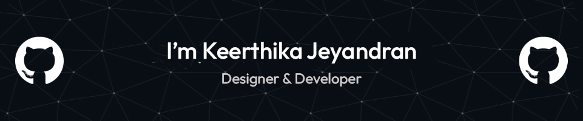

<h3 align="center">A dedicated Software Engineer & Designer hailing from Sri Lanka</h3>

 

  

- 🔭 I’m currently working on **KJ Creations Webpage**

- 🌱 I’m currently learning **React JS**
 
- 👯 I’m looking to collaborate on **GSOC 2024**

- 💬 Ask me about **JS , Java , React Js**
 
- 📫 How to reach me **jeyandrankeerthi@gmail.com**

<h3 align="left">Connect with me:</h3>

 

<h2 align="center">🔥 Languages-Frameworks-Tools 🔥</h2>
 

  <a href="https://skillicons.dev">
     
    
  </a>
 
  
 

<h2 align="center">⚡ Stats ⚡</h2>
 

  

    
    
  

           
  

    
  

   
   

  <h2> My Contributions </h2>
   
  
  
     

